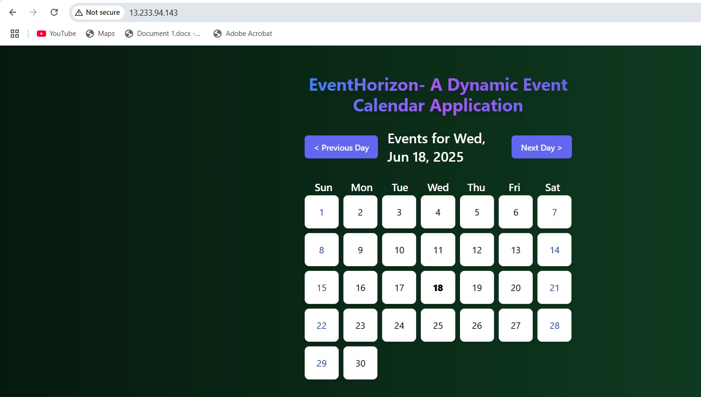

# 🗓️ Calendar Event App

A simple React-based calendar event web application. This project was containerized using Docker and deployed to AWS ECS with Fargate.

---

## 📦 Tech Stack

- **Frontend**: React.js
- **Containerization**: Docker
- **Cloud Hosting**: AWS ECS (Fargate)
- **Image Registry**: Amazon ECR

---

## 🚀 Features

- View and manage calendar events (React UI)
- Fully containerized with multi-stage Docker build
- Deployed on AWS ECS with a public IPv4 endpoint
- Lightweight and scalable setup using Fargate (serverless containers)

We used a **multi-stage build** to optimize Docker image size

🐘 AWS Deployment (ECS + Fargate)
Steps followed

Build Docker Image Locally

docker build -t calendarevent-app .

Push Image to Amazon ECR
aws ecr create-repository --repository-name calendarevent-app

aws ecr get-login-password --region ap-south-1 | docker login --username AWS --password-stdin <your-repo-uri>

docker tag calendarevent-app <your-repo-uri>

docker push <your-repo-uri>

Created ECS Cluster via AWS Console

Created Task Definition and Service to run container using Fargate.

Configured Security Group & Load Balancer for internet access.

